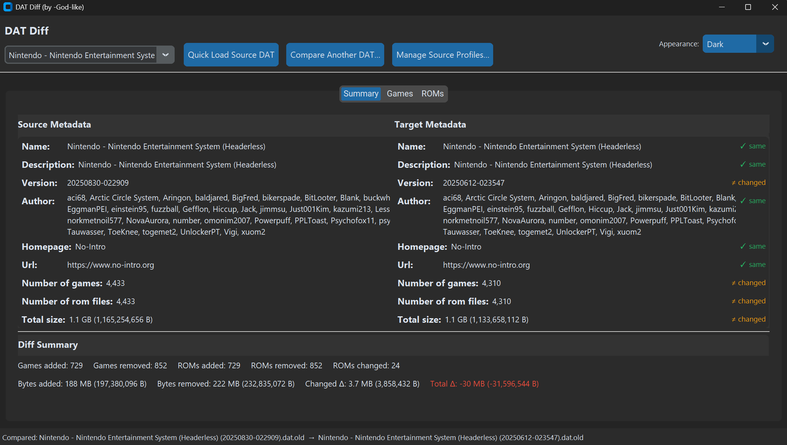
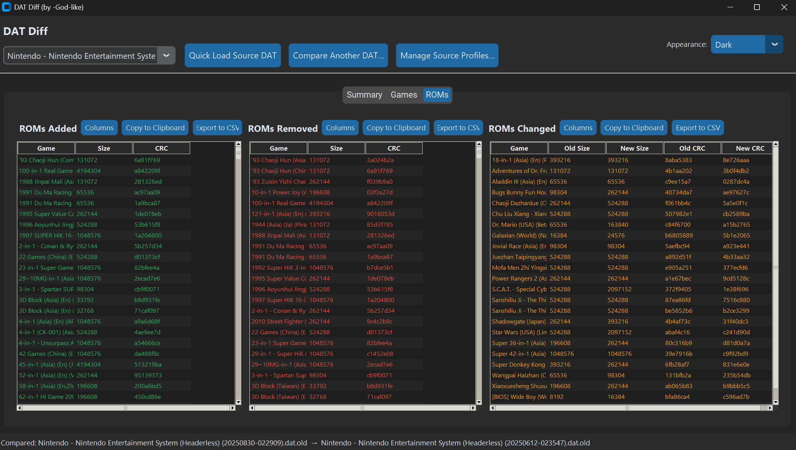

# DAT Diff

`DAT Diff` is a desktop GUI app for comparing two DAT/XML files used by ROM managers (e.g., ClrMAMEPro, RomVault). It shows what games/ROMs were **added**, **removed**, or **changed** (size/checksums), along with side-by-side metadata and dataset stats.

---

## ✨ Features

- **Modern CustomTkinter UI** with Dark/Light/System themes and crisp fonts.
- **Reads multiple formats:** `.dat`, `.xml`, plus compressed `.gz` and `.zip` (with an in-zip file picker if the archive contains multiple DAT/XML files).
- **Profiles** for frequently used **source** DATs (add, bulk add, rename, re-browse, delete). Stored in `profiles.json`.
- **Quick Load** a source DAT without creating a profile.
- **Tabbed results:** **Summary**, **Games**, **ROMs**.
- **Diff views** for:
  - Games added/removed
  - ROMs added/removed/changed (size + CRC/MD5/SHA1 deltas)
- **Summary panel** with source/target metadata (name, description, version, date, author, etc.), total counts (games/ROMs), and byte-delta stats with human-readable units.
- **Tables you can work with:**
  - Sort by any column (numeric/text aware)
  - Zebra striping and color tags: Added (green), Removed (red), Changed (orange)
  - Column visibility dialog per table, persisted in `ui_prefs.json`
  - **Copy to Clipboard** and **Export to CSV** actions

---
## Screenshots





---
## 📦 Installation

### Pre-built standalone Windows binary
- Download this from the releases section
- No prereqs or dependencies
  
### Prerequisites
- Python 3.x with Tkinter available (Tkinter ships with standard CPython installers on Windows/macOS; on some Linux distros you may need to install `python3-tk`).

### Install dependencies
```bash
pip install customtkinter
```

> No other third-party packages are required; the rest are Python standard library modules (e.g., `gzip`, `zipfile`, `hashlib`, `xml.etree.ElementTree`).

---

## ▶️ Usage

### Run the app (just double click the .exe if using the stanadone from the releases section)
```bash
python dat_diff.py
```

### Typical workflow
1. **Pick a Source**  
   - Choose an existing **profile** from the dropdown, **or** click **Quick Load Source DAT** to select a one-off DAT/XML/ZIP/GZ.
2. **Compare to a Target**  
   - Click **Compare Another DAT…** and select the target file (supports picking inside ZIPs when multiple matching files exist).
3. **Review results**
   - **Summary**: side-by-side metadata, dataset counts (games/ROMs/bytes), and byte delta stats.
   - **Games**: Added / Removed lists.
   - **ROMs**: Added / Removed / Changed with sizes + CRC/MD5/SHA1.
4. **Work with tables**
   - Click column headers to sort; numeric columns sort numerically.
   - Use **Columns** to toggle visible columns (ROM tables). Preferences persist in `ui_prefs.json`.
   - **Copy to Clipboard** or **Export to CSV** directly from each header.

---

## 🗂️ Files the app creates

- `profiles.json` — saved source profiles (name → path, optional ZIP member).
- `ui_prefs.json` — your visible-column preferences for each table.

Created automatically in the working directory.

---

## 🔍 How it works (technical overview)

- **Parsing**: robust, namespace-agnostic XML that accepts both `<game>` and `<machine>` elements; extracts `size`, `crc`, `md5`, `sha1`. Supports DAT/XML in plain files, `.gz`, or `.zip` (with inner selection).
- **Indexing**: builds a `DatIndex` with fast lookups keyed by `(game, rom)`.
- **Diffing**: computes **games added/removed**, **ROMs added/removed**, and **ROMs changed** when size/checksums differ.
- **Summary stats**: totals for games/ROMs/bytes and human-readable byte deltas (KB/MB/GB/TB).
- **UX**: background work for parsing (keeps UI responsive), zebra striping, and colored tags for add/remove/change.

---

## ❓ FAQ

**Can it compare two DATs inside ZIP files?**  
Yes. You can pick an inner DAT/XML when the `.zip` contains more than one candidate file.

**Where are “Quick Load” selections stored?**  
Quick loads don’t create a profile; they are used for the current session only. Saved profiles live in `profiles.json`.

**Why do some byte totals show “Unknown”?**  
Some entries (e.g., CHD `<disk>` elements) may not include `size`; totals become “Unknown” when sizes are absent.

**What is the point of the profiles?**
Profiles, which are optional, let you save commonly used source DAT files so you don’t have to reselect them each time. A profile stores the file path (and, if needed, the specific DAT inside a ZIP). Once saved, you can quickly reload that DAT for future comparisons, rename or organize profiles, and manage them in bulk.

**Can the Profile Manager bulk-add multiple DATs from inside a ZIP?**
Yes. When you select a ZIP file, the app will let you choose which DAT/XML files inside to add. You can pick them manually, use Select All, or Deselect All as needed.
